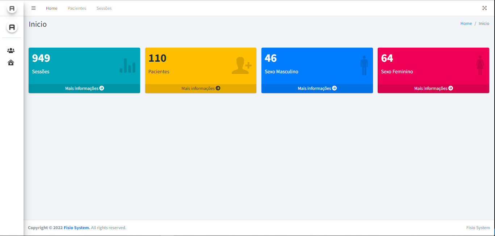
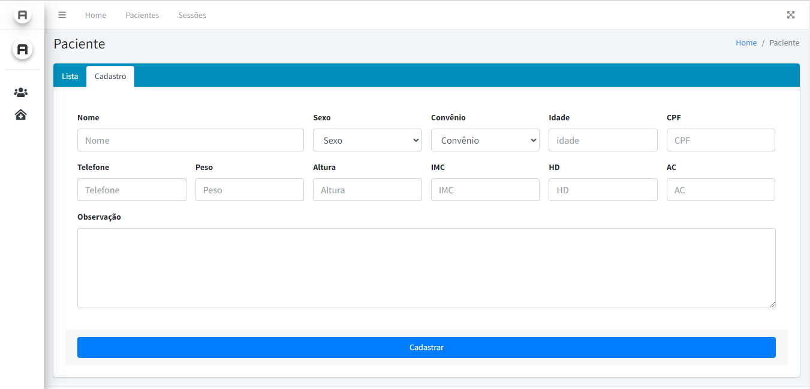

# Fisio-system

O Sistema de Controle de Consultas de Fisioterapia é uma aplicação web desenvolvida em PHP que permite aos fisioterapeutas registrar e gerenciar informações sobre pacientes e sessões de fisioterapia.

## Funcionalidades

- ##### Cadastro de Pacientes:
  Os fisioterapeutas podem cadastrar novos pacientes, incluindo informações como nome, idade, sexo, histórico médico e contato.

- ##### Registro de Sessões:
  Durante as sessões de fisioterapia, os fisioterapeutas podem fazer registros detalhados sobre o progresso do paciente, exercícios realizados, sensações do paciente, entre outros.

- ##### Ficha de Avaliação:
  Com base nos registros das sessões, o sistema gera automaticamente uma ficha de avaliação que inclui informações do paciente, dados das sessões anteriores e um gráfico mostrando o progresso ao longo do tempo.

## Tecnologias Utilizadas

- ##### coffeecode/datalayer:
  Facilita interações com bancos de dados usando PDO.
- ##### coffeecode/router:
  Oferece um sistema de roteamento flexível para aplicações web.
- ##### ext-pdo (PHP Data Objects):
  Fornece uma interface para acessar bancos de dados no PHP.
- ##### league/plates:
  Mecanismo de modelo PHP leve e flexível para construir interfaces de usuário.

|  |  |
| ---------------------------- | -------------------------------- |
